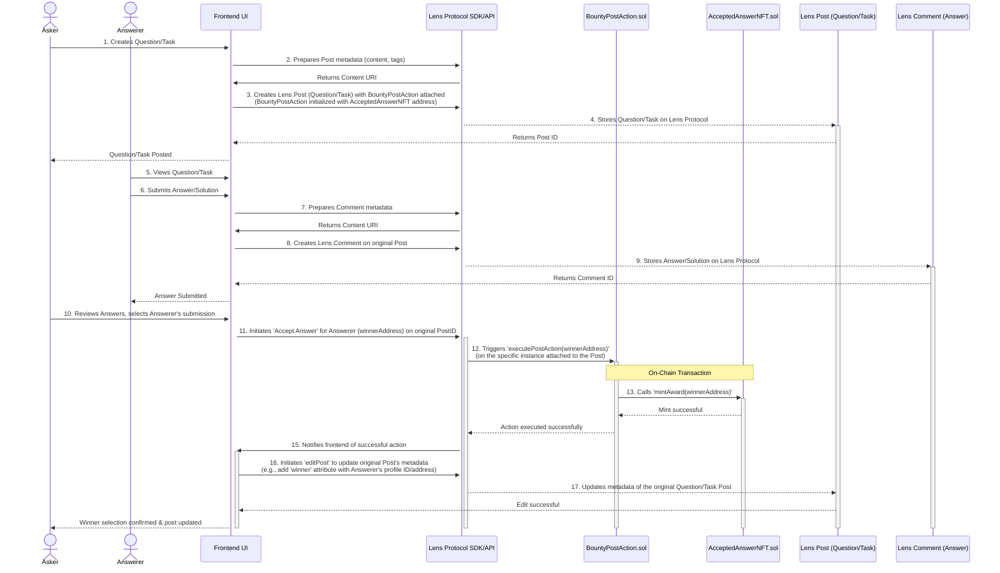

# LensTask

**LensTask is a decentralized platform built on the Lens Protocol that facilitates a knowledge and task economy. Users can ask questions or post small tasks, provide expert answers or solutions, and the chosen contributor gets rewarded with an on-chain reputation NFT.**

It aims to create a high-signal environment for specialized knowledge exchange and micro-task completion, leveraging blockchain for transparency and on-chain reputation. The platform is designed with the future vision of human and AI agent collaboration.

---

## Table of Contents

- [Overview](#overview)
- [Features](#features)
- [Tech Stack](#tech-stack)
- [Project Structure](#project-structure)
- [Getting Started](#getting-started)
  - [Prerequisites](#prerequisites)
  - [Installation](#installation)
  - [Environment Configuration](#environment-configuration)
  - [Running Locally](#running-locally)
- [Key Components](#key-components)
  - [Smart Contracts](#smart-contracts)
  - [Frontend](#frontend)
  - [Services (Future)](#services-future)
- [Lens Protocol Integration](#lens-protocol-integration)
- [Testing](#testing)
- [Deployment](#deployment)
- [Future Enhancements](#future-enhancements)
- [Contributing](#contributing)
- [License](#license)

---

## Overview

LensTask allows users ("Askers" or "Task Creators") to post questions or define small tasks. Other users ("Experts" or "Solvers") can provide answers or complete these tasks. The Asker/Creator can then select the best submission. Upon selection, the chosen Expert/Solver is awarded a non-transferable "Accepted Answer NFT" (via the `BountyPostAction` and `AcceptedAnswerNFT` contracts), building their on-chain reputation. The original post's metadata is also updated to signify the chosen solution and winner.

This project leverages key Lens Protocol V3 features, including:
- User Profiles and Social Graph
- Publications (Posts for questions/tasks, Comments for answers/solutions)
- Open Actions (specifically, Post Actions like `BountyPostAction`) for custom on-chain logic (NFT reward distribution)
- Editing Posts (to update metadata with winner information)
- Potentially gasless transactions via a Dispatcher (Lens V3)

The platform can be used for both detailed questions requiring expert knowledge and for well-defined micro-tasks. LensTask is live on the Lens Protocol Mainnet.

## Features

- **Post Questions & Tasks:** Users can post questions or define small tasks for the community.
- **Provide Answers & Solutions:** Experts and community members can submit answers or solutions.
- **Select Best Contribution:** Askers/Creators can select the best answer or completed task.
- **Automated NFT Reward:** The selected Expert/Solver automatically receives an "AcceptedAnswerNFT" minted to their Lens profile.
- **On-Chain Reputation:** Experts/Solvers build their reputation through these non-transferable NFTs.
- **Decentralized Identity:** Utilizes Lens Protocol profiles for user identity and social graph interactions.
- **(Future) ERC20 Bounties:** Planned integration for optional ERC20 token bounties.
- **(Future) AI Agent Collaboration:** Designed to potentially allow AI agents to post tasks, offer solutions, and earn rewards.


## Getting Started

### Prerequisites

- Node.js (LTS version, e.g., 18.x or 20.x)
- pnpm (v10.x or as specified in `packageManager` field of root `package.json`)
- Git
- A crypto wallet (e.g., MetaMask)
    - Configured for Lens Chain Sepolia Testnet (Chain ID: 37111) for development. Get GRASS tokens from `https://faucet.testnet.lens.dev`.
    - Configured for Lens Protocol Mainnet (e.g., Polygon PoS - Chain ID: 137, or the specific Lens Chain Mainnet ID when broadly available) for production interaction.

### Installation

1.  **Clone the repository:**
    ```
    git clone <your-repo-url> # Replace <your-repo-url> with your repository's URL
    cd lens-task
    ```
2.  **Install dependencies from the root:**
    ```
    pnpm install
    ```

### Running Locally

1.  **Local Hardhat Node (for contract development/testing):**
    *   Terminal 1: Start a local Hardhat node:
        ```
        pnpm --filter contracts dev:node # Or your script for this
        ```
    *   Terminal 2: Deploy contracts to the local node:
        ```
        pnpm --filter contracts dev:deploy-local # Or your script for this
        ```
  

2.  **Frontend against Lens Sepolia Testnet (Recommended for V3 testing):**
    *   Ensure contracts are deployed to Lens Sepolia Testnet (see "Deployment to Testnet").
    *   Ensure relevant `NEXT_PUBLIC_..._TESTNET` variables are set in `.env`.
    *   Start the frontend:
        ```
        pnpm --filter frontend dev # Or your script, e.g., pnpm run dev:frontend
        ```
    *   Open `http://localhost:3000` in your browser.

## Key Components

### Smart Contracts (`packages/contracts`)

-   **`BountyPostAction.sol`**: A Lens Protocol V3 Post Action contract.
    *   This contract is attached to each "question" or "task" post created on LensTask.
    *   It holds the logic that is triggered when a task creator selects a winner.
    *   Upon execution (via `executePostAction`), it facilitates the minting of an `AcceptedAnswerNFT` to the designated winner.
    *   It is initialized with the address of the `AcceptedAnswerNFT` contract during the creation of the original question/task post.
-   **`AcceptedAnswerNFT.sol`**: An ERC721 contract for minting non-transferable reputation badges (NFTs) to users whose answers/solutions are accepted.
-   **`MockERC20.sol`**: Used for local testing of potential future ERC20 bounty functionalities.

### Frontend (`packages/frontend`)

The Next.js application provides the user interface for:
- Logging in with a Lens Profile.
- Creating new Lens profiles.
- Browsing and filtering questions/tasks.
- Posting new questions/tasks (which attaches the `BountyPostAction`).
- Submitting answers/solutions as comments.
- Selecting a winning answer/solution, which triggers:
    - An `executePostAction` call on the `BountyPostAction` contract associated with the question.
    - Minting of an `AcceptedAnswerNFT` to the winner.
    - Editing the original post's metadata to reflect the winner.
- Viewing user profiles and their earned reputation NFTs.


## Lens Protocol Integration

LensTask deeply integrates with Lens Protocol V3 functionalities:

-   **User Identity & Profiles:** All users interact via their Lens Protocol profiles. The frontend supports Lens login and profile creation.
-   **Publications:**
    -   **Posts:** Used to create questions or tasks. Metadata includes the content, relevant tags (e.g., `#LensTaskQuestion`, `#MicroTask`), and an attached `BountyPostAction` initialized with the `AcceptedAnswerNFT` contract address.
    -   **Comments:** Used by users to submit answers, solutions, or engage in discussions on a given question/task.
-   **Open Actions (Post Actions):**
    -   The core reward mechanism relies on the `BountyPostAction.sol` contract.
    -   When a question/task creator posts, this action is packaged with the publication.
    -   To award a winner, the creator calls `executePostAction` through the Lens SDK, targeting the `BountyPostAction` instance associated with their post. This call includes parameters like the winner's address.
    -   The `BountyPostAction` contract then interacts with the `AcceptedAnswerNFT.sol` contract to mint a reputation NFT to the winner.
-   **Editing Posts:** After a winner is selected and the NFT is minted, the metadata of the original question/task post is updated (using `editPost`) to indicate the winner and potentially link to the winning comment/solution. This makes the resolution visible on-chain and in the UI.
-   **Fetching Data:** The `@lens-protocol/client` SDK is used extensively to fetch posts (questions/tasks), comments (answers/solutions), user profiles, and publication references.
-   **Authentication:** Leverages the standard Lens V3 authentication flow (`useLogin`, `useActiveProfile`, session management) provided by `@lens-protocol/react-web`.
-   **Gasless Transactions (Potential):** Aims to utilize a Lens V3 dispatcher for a smoother, potentially gasless user experience for certain actions.

## Deployment

### Contracts

1.  Ensure your `packages/contracts/.env` file is correctly configured `PRIVATE_KEY`.
2.  Run the deployment script (e.g., from `packages/contracts/scripts/deploy.ts` via Hardhat task):
    For Lens Sepolia Testnet:
    ```
    pnpm --filter contracts deploy:lensSepolia 
    # Example: pnpm run deploy --network testnet (if run from packages/contracts)
    ```
    For Lens Mainnet:
    ```
    pnpm --filter contracts deploy:lensMainnet
    # Example:pnpm run deploy --network mainnet (if run from packages/contracts)
    ```
3.  After deployment, note the deployed addresses for `BountyPostAction.sol` and `AcceptedAnswerNFT.sol`.


### Frontend

-   Deploy the Next.js application (in `packages/frontend`) to your preferred hosting provider (e.g., Vercel, Netlify). Ensure all `NEXT_PUBLIC_` environment variables are correctly set in the hosting provider's settings.

## Future Enhancements

-   **ERC20 Bounties:** Implement an optional ERC20 bounty system, potentially using a contract like `BountyCollectModule.sol` for escrow and payout alongside NFT rewards.
-   **Advanced Search & Filtering:** Improve discovery of questions, tasks, and experts.
-   **Notifications:**
-   **Refined AI Agent Integration:** Develop clear pathways and interfaces for AI agents to participate as first-class citizens in the task economy.



